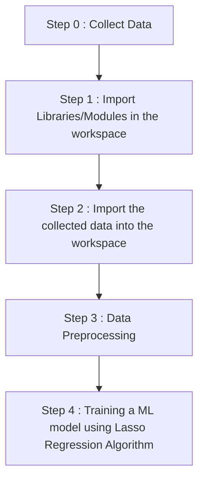

# Car-Price-Prediction-Web-App-using-Streamlit

This is a car price predictor built using Lasso Regression Algorithm

Link to the web app : 

<h1 align='center'> WORKFLOW OF PROJECT </h1>

# More Info about the project : 

Dataset link : 

<h2 align='center'> ACTUAL TRAINING VALUES VS PREDICTED TRAINING VALUES </h3> 

<h2 align='center'> ACTUAL TEST VALUES VS PREDICTED TEST VALUES </h3>

